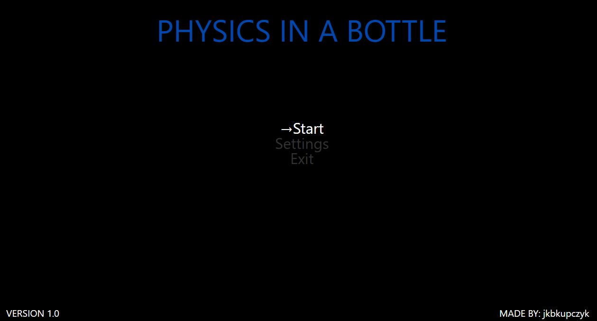
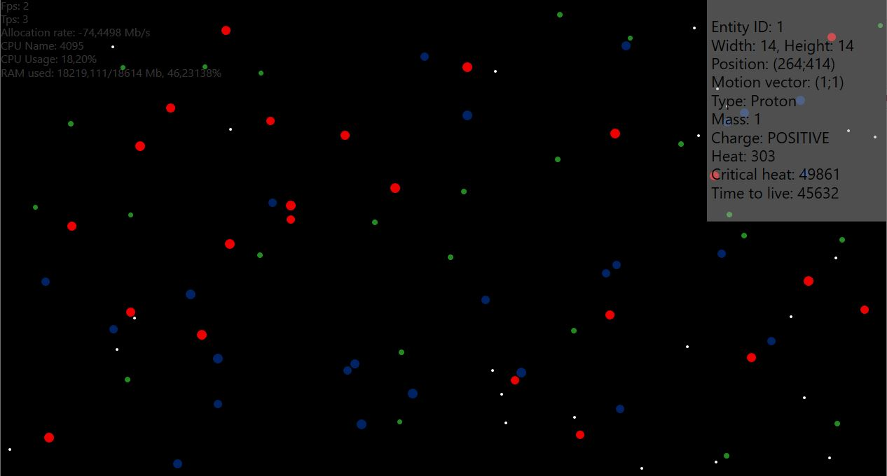

# particle-game
Simple game made with C# WPF. Simulates particle movement ⚛

## Running
See [Releases](https://github.com/jkbkupczyk/particle-game/releases)

## TODOs
- Implement entity Collision
- Improve entity movement
- Implement Settings menu
- Implement Serialization/Deserialization
- Upgrade to .NET 7
